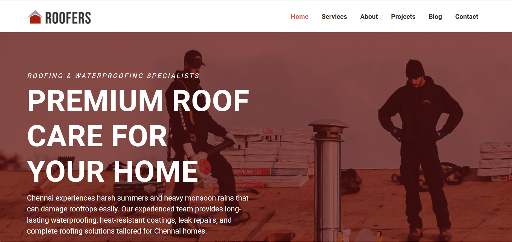
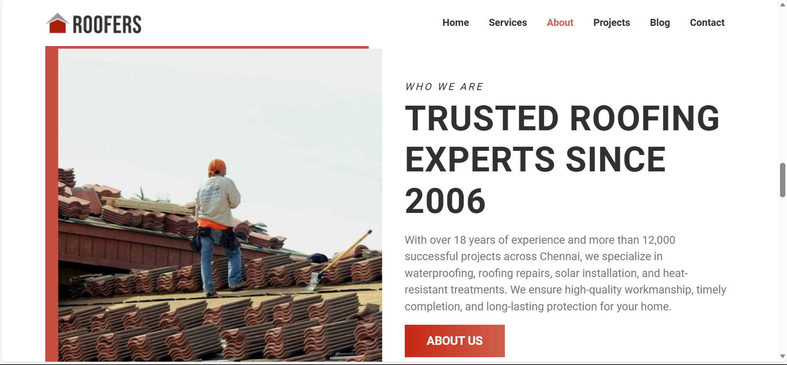
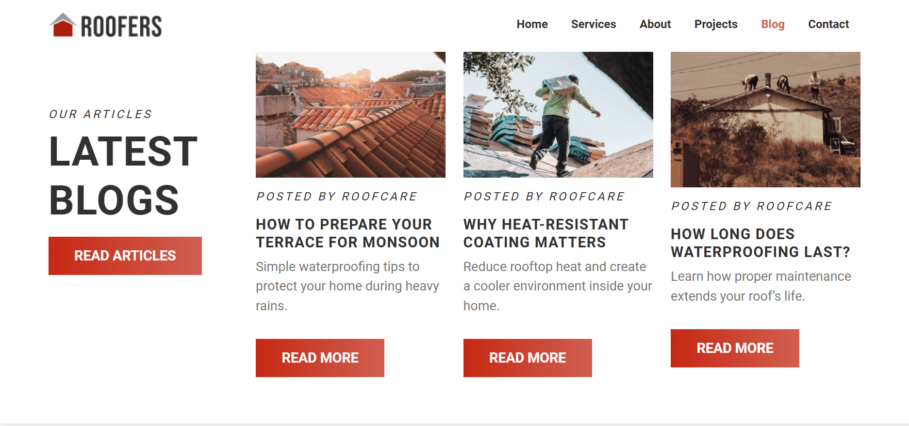
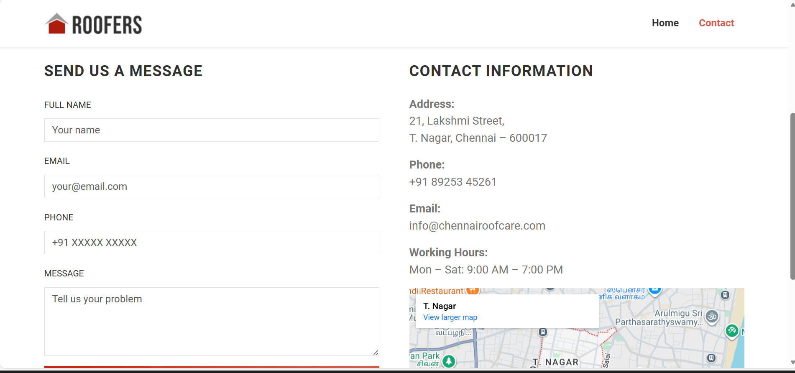

# 🏠 Chennai RoofCare Website

A professional, responsive roofing service website designed for Chennai climate conditions.  
This project includes a clean UI, responsive layout, and a functional Contact Us page.

---

## 🌦️ Project Overview

Chennai RoofCare provides premium roofing solutions including:

- Waterproofing solutions
- Heat-resistant roof coatings
- Leak repairs
- Complete roofing services for homes and buildings

Designed keeping **Chennai’s harsh summers and heavy monsoons** in mind.

---

## 🖥️ Live Pages

- Home Page  
- Contact Us Page (with form & Google Map integration)

---

## 📸 Project Screenshots

### 🏠 Home Page

 ##About page
 

  ###provide page page
 

 ###FAQ PAGE
![FAQ PAGE] (images/faq.png)

### 📞 Contact Page

 

---

## 🛠️ Technologies Used

- HTML5
- CSS3
- Bootstrap 5
- Responsive Web Design
- Google Maps Embed

---

## ✨ Features

- Sticky responsive navbar
- Mobile-friendly layout
- Professional contact form
- Embedded Google Map (T. Nagar, Chennai)
- Clean and modern UI
- SEO-friendly structure

---

## 📂 Project Structure

